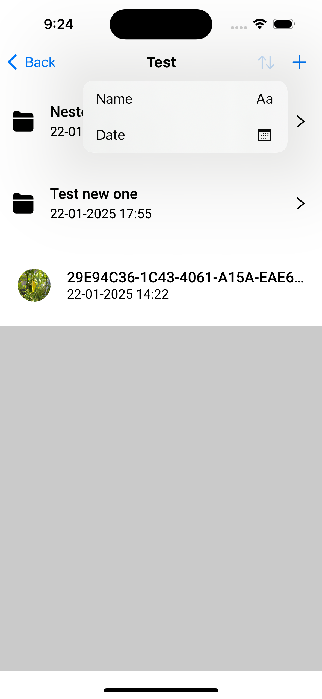
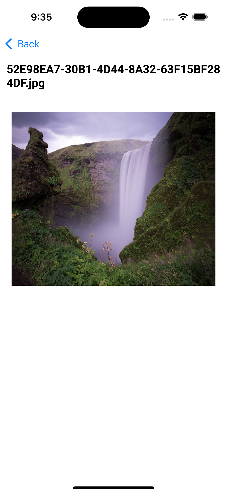
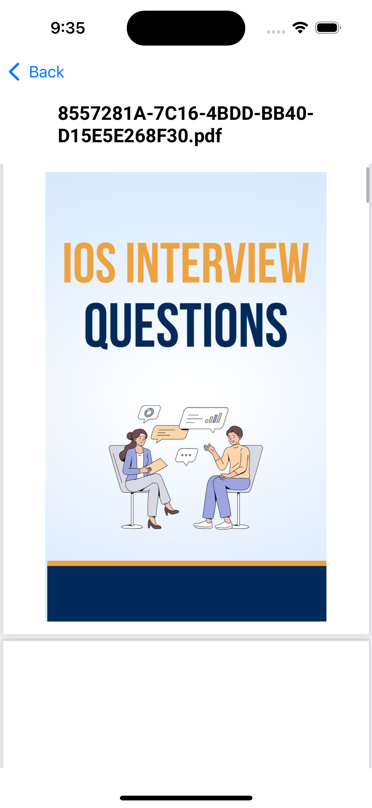

## SCREENSHOTS:

*Home Page*:

  

*Sort Options*:

  

*Add Options*:

  

*Create New Folder*:

  

*Add to favourites:*

  

*Remove from favourites:*

  

*Image preview:*

  

*Pdf preview:*

  

